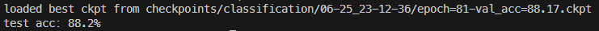
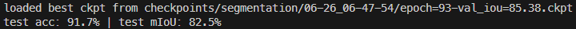
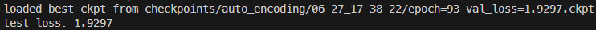

# Summer_Intern_Tutorials

# Tutorial 1

## Results

### Task 1

On ModelNet40 test set:
|                                 | Overall Acc |
| ------------------------------- | ----------- |
| Paper                           | 89.2 %      |
| Tutorial's (w/o feature trans.) | 88.6 %      |
| Tutorial's (w/ feature trans.)  | 87.7 %      |
| Mine (w/ feature trans-no reg.) | 88.2 %      |

Success condition : Test accuracy over 85%

**PASSED!**

&nbsp;

### Task 2

On ShapeNet Part test set:
|            | ins. mIoU |
| ---------- | --------- |
| Paper      | 83.7 %    |
| Tutorial's | 83.6 %    |
| Mine       | 82.5 %    |

Success condition : Test mIoU over 80%

**PASSED!**

&nbsp;

### Task 3

On ModelNet40 test set:
|            | Chamfer Dist.                      |
| ---------- | ---------------------------------- |
| Tutorial's | 0.0043 (8.8064 for not normalized) |
| Mine       | 1.9297 (not normalized)            |

Success condition : Chamfer Distance lower than 10.24 (not normalized)

**PASSED!**